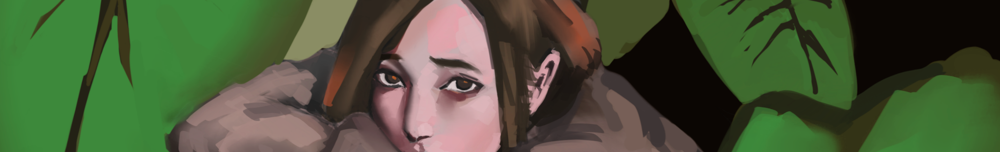

## Why

Late last year, I was introduced to [Blockstack](https://blockstack.org/) through Lambda School.
At that point, I was about to finish 7 months long Full Stack web development
course. Which means I needed to start my job search pretty soon. However, I
didn't want to do that... yet.

Since high school, I have a vague image of what I will be doing in the future.
Building cool things, not other people's ideas but my own. Taking a job means
I would not be seeing that vision. So I delayed my job search and tried to look
for other ways to make a living. I can afford to do this because I don't have a
lot of responsibilities, I'm taking advantage of that fact.

Obviously, the chance of being the next Mark Zuckerberg is next to impossible.
But that doesn't discourage me to pursue the startup life. There are other people
like Pieter Levels and other indie hackers who give me hope. They don't build
anything too big or famous but still able to create profitable businesses. That is my
goal at the moment, profitability of the things I make.

In a couple of months after Lambda School, I learned that it's very hard to find
an idea that people are willing to pay for. I created a gumroad store, a while
back and started selling products on it. Mostly art assets in the beginning, but
no sales. Then I started selling software licenses for a browser extension and
a photoshop script. Still no sales, maybe I am doing something wrong.

## Blockstack

While I'm doing things trying to earn money, I need money to keep going. That's
where [Blockstack](https://blockstack.org/) comes in. Blockstack describes itself
as a "Decentralized computing network and app ecosystem", they make developer tools
so people like me can easily create Decentralized apps. They have the [app mining](https://app.co/mining)
a program that rewards decentralized apps made with blockstack.

I spend the past 4 months building Blockstack apps. So far, I made two, [Socialli](https://socialli.st/)
and [LofiFocus](https://lofifocus.io/).

**Socialli** is a Facebook groups alternative. I spent maybe about 2 months building it.
I took longer because I was learning blockstack while I was building it. Decentralized
apps are also new to me, so I made a lot of mistakes and some things I know how to do
don't apply. For example, a `liking` feature, if you know how to code "normally"
you would increment a `likes` property on a post. But you can't do that if you are making
a blockstack app.

**LofiFocus** is a music app that plays lofi music to help people focus on work. The time
I spend building it is way shorter than Socialli. I built it in about one week, mostly
because I reused the code I wrote from the previous app. It's also a very simple app compared
to socialli, plus I now know what works and what doesn't. Not that it doesn't have its
challenges, being a music app I need music on it. Luckily, my brother is a music
producer so I had some help for the initial tracks for the app. I had to buy music
from other producers since my brother is busy doing his own thing and can't produce
music for my app consistently.

### Guess which app won $15k?

That's right, Socialli. Just kidding, it's LofiFocus! I know, it surprised me too.
I submitted LofiFocus to app mining in January with only 3 lofi tracks. Also, I
posted it on producthunt and people seem to like it with 183 upvotes.
I'm happy that a thing I made is worth something. But the fact that LofiFocus
did better than Socialli is kind of disappointing to me. Socialli has more potential,
it can be used for different communities to live online while LofiFocus only plays music.

The Blockstack team decided to pause app mining until they or the community, in general,
find a way to prevent apps like LofiFocus to get most of the rewards.

If you want to learn how to build blockstack apps, you can start [here](https://docs.blockstack.org/develop/zero_to_dapp_1.html).
You can also ask me some questions if you want. :)

