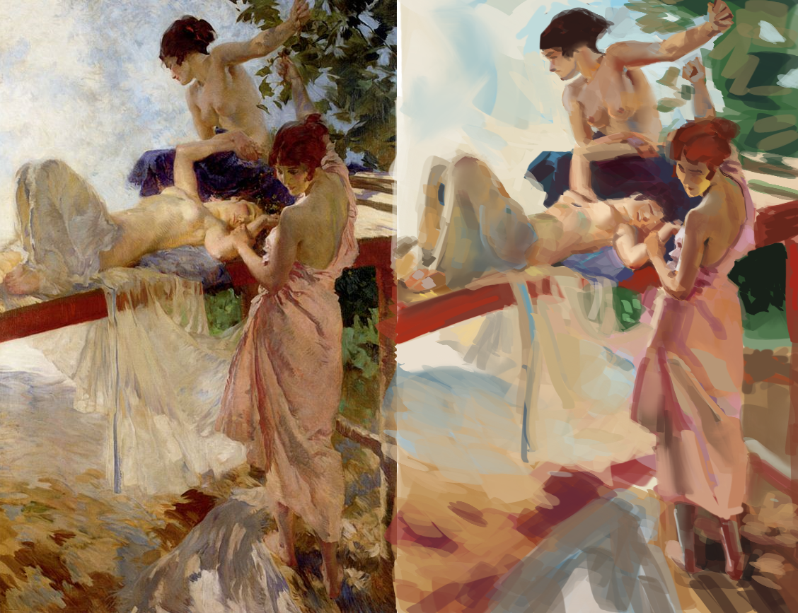
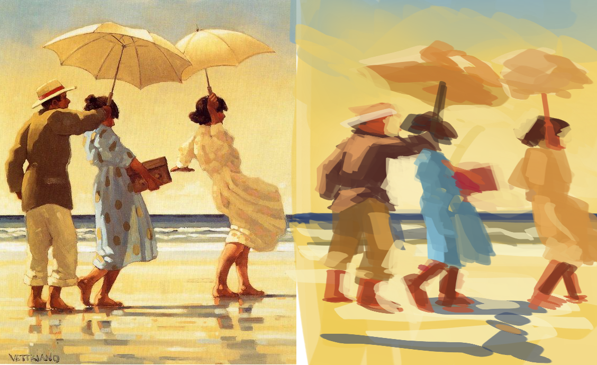
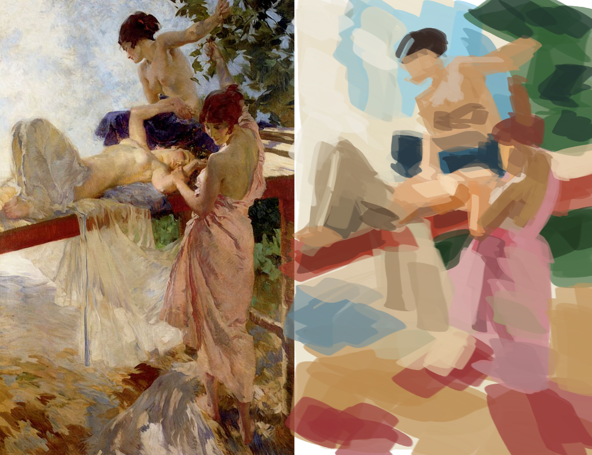
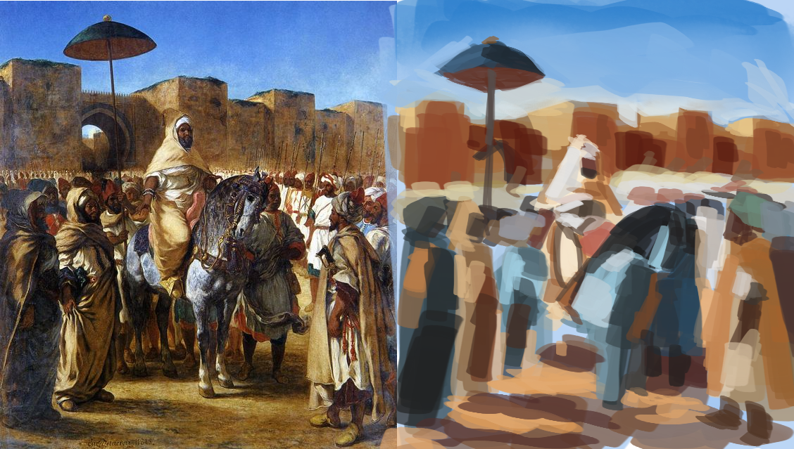
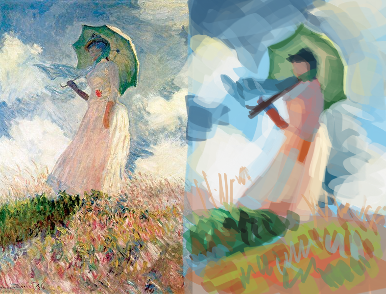
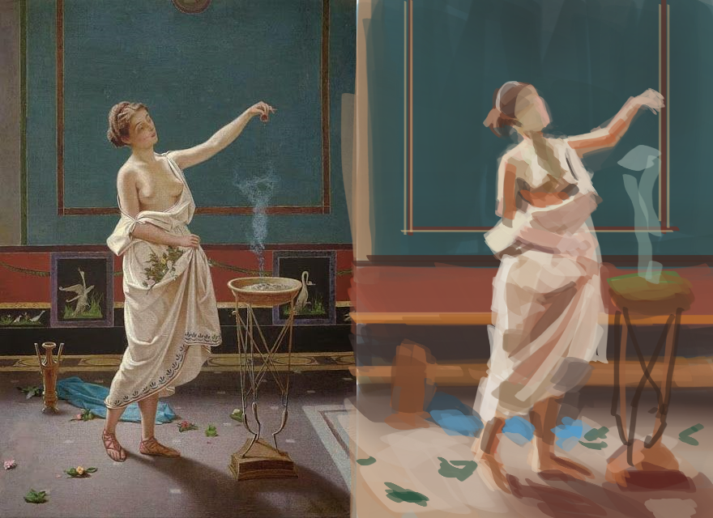
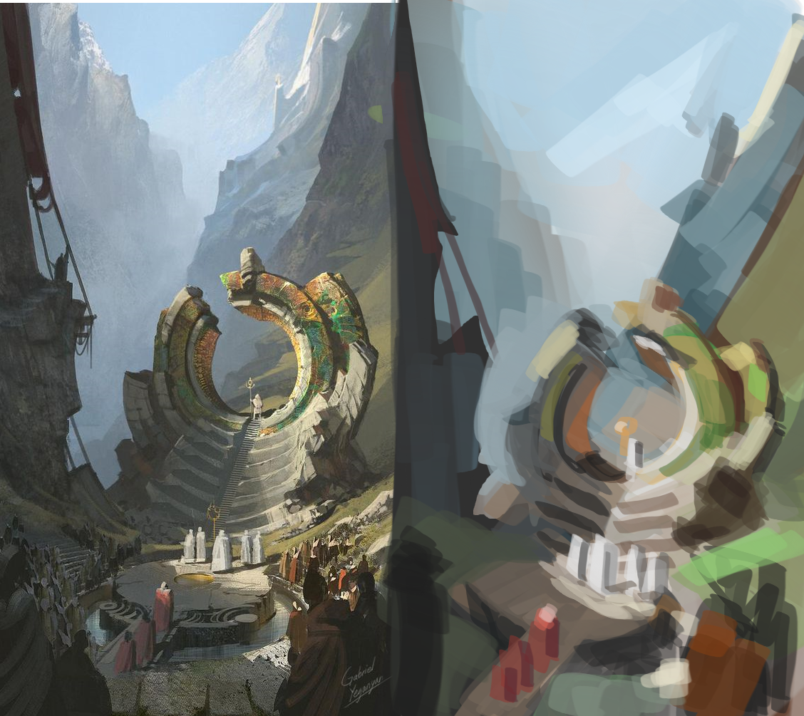
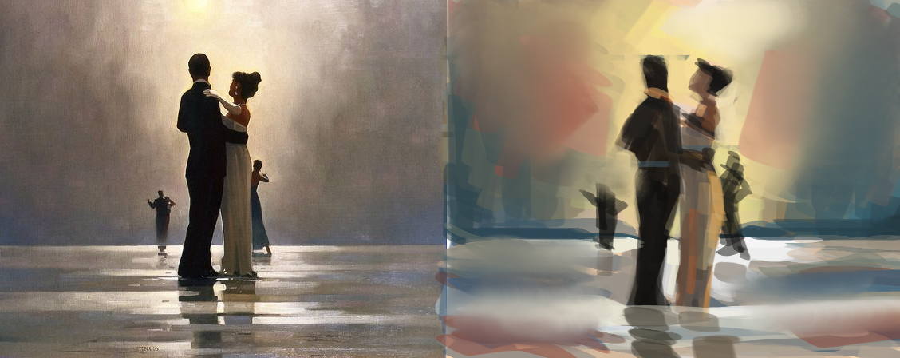
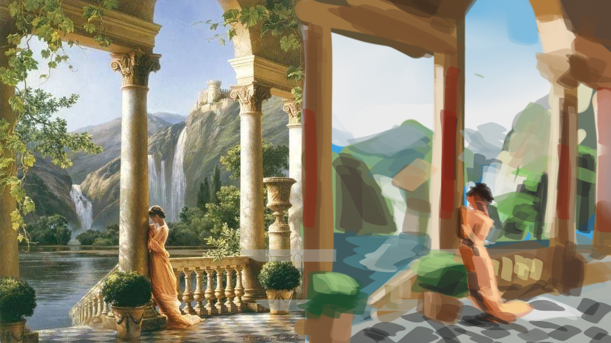
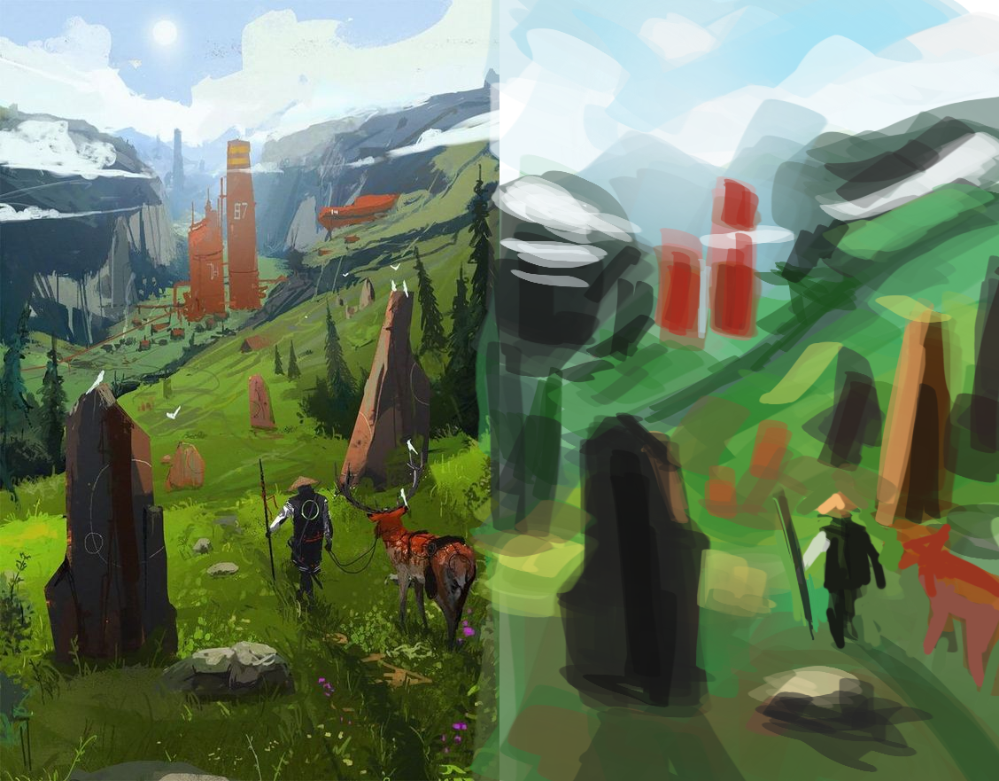

If you don’t already know, I love art. I love looking at them, and I try to make my own as well.
I’ve been drawing since childhood, but I started getting kinda serious about it about 5 years ago
when I bought my first drawing tablet. From then on I tried improving on my own. Watching youtube videos,
reading about art concepts to make my art better. You could see most of my artwork on my [instagram page](https://www.instagram.com/xanderjakeq.art/).

There are a lot more that I didn't put online. My current skill isn't at the level that I want it to be.
In the past year and a half, I got serious at learning software development through [Lambda School](https://lambdaschool.com/).
My experience on that journey is for another post, but I would say that it was successful. I feel like I can build
any app that I want to create. This is what I want my art skills to be at. When I have an idea,
I want to be able to paint it. To do that, I need to do the same thing I did to have my current software
development skills, invest time and money on my art skills. Whether or not I can make a career
with my art, I don't care. I want to improve because I want to.

I could go to art school, but nah. I heard somewhere on the internet that the best way to learn
any specific skill is to learn it from an expert. Luckily as I was searching for pro artists to learn
from, someone I was following for a while started to accept students. It took me some time to decide
but last month, I made up my mind. I want to learn from the great [Steven Zapata](https://www.instagram.com/stevenzapata_art/).

## Instruction

The way this is going to work is that I set my goal and Steven will help me get there. My goal
is to improve my art skills but specifically, I want to be able to create good illustrations.
The exercise Steven gave me is doing master copies. While doing the copies, I need to observe
3 things that I think make a good painting. For me, a good painting has good values, shapes and
balance. These are the three things I try to extract from the (master) paintings that I liked.

If you want to do the same exercise, here are some steps you could follow:

1. Go to pinterest, create a board.
2. Search for illustrations that you like and add them to your board.
3. When you are done collecting good illustrations, view your board and observe what's common among them. Maybe color,
subject matter, rendering style?

Note: "Good" is subjective. This is a personal exploration so add whatever illustration that you like
to your board.

4. Open whatever drawing app you like, copy & paste one of the illustrations on your board. Zoom out until
the size of the painting is no larger than your phone on the screen then paint your copy beside it. Focus
on the aspects of the illustration that you think makes it a good one. Do this however many times you want. You can
choose to zoom in and spend more time on some of them.

Here's some that I did (original on the right copy on the left):

## What I learned

Doing this exercise for one week and having Steven point out to me things I didn't notice on the original
illustration that is missing on my copy, I learned a few things.

Values are used to describe the lighting of the scene. Good control of values helps portray the
dimensionality of the subject like showing the volume of a muscle. It could also be used to show
the position of objects relative to the viewer. This is most noticeable in landscape paintings where
closer objects are darker and get lighter the farther things are from the camera.

Shapes can be used to group elements of the image. You can have a group of people but zoomed out,
they look like one triangle shape. It could be a person, very detailed with accessories, elaborate clothing
folds but when you look at it from afar, they look like one shape but you still know exactly what it is. I learned
that good shapes help make a good illustration by making it more readable.

Balance is challenging for me. A balanced illustration for me is that it doesn't feel like it's missing
something. It is a feeling so it is hard to explain but after my call with Steven, I think I know what makes an
illustration feel balanced. He seldom talks about how the viewer's gaze would move throughout the painting.
If it has 1 focal point, a good painting would have supporting elements that would pull the viewer's gaze back
to the focal point. Or if it has multiple focal points, it would successfully guide the viewer to each
one and create a cycle from the 1st focal point to the nth and back. It would feel immersive and make the
viewer somehow be in the painting.

I'm going to be doing more of these in the future. I don't expect to learn everything that makes a good painting
in one week. Follow this [board](https://www.pinterest.com/xanderjakeq/sketch-dump/) if you want to see more studies from me.

