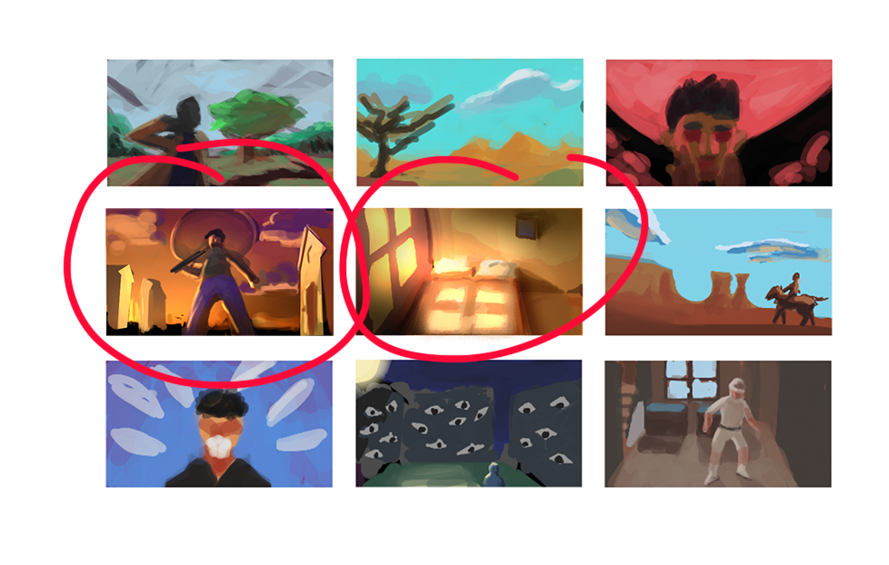
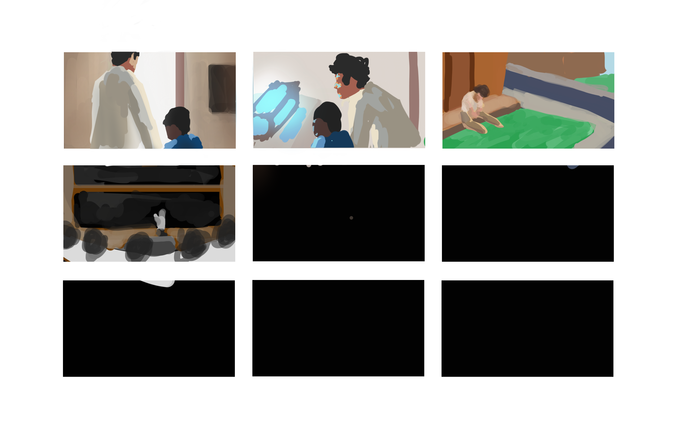
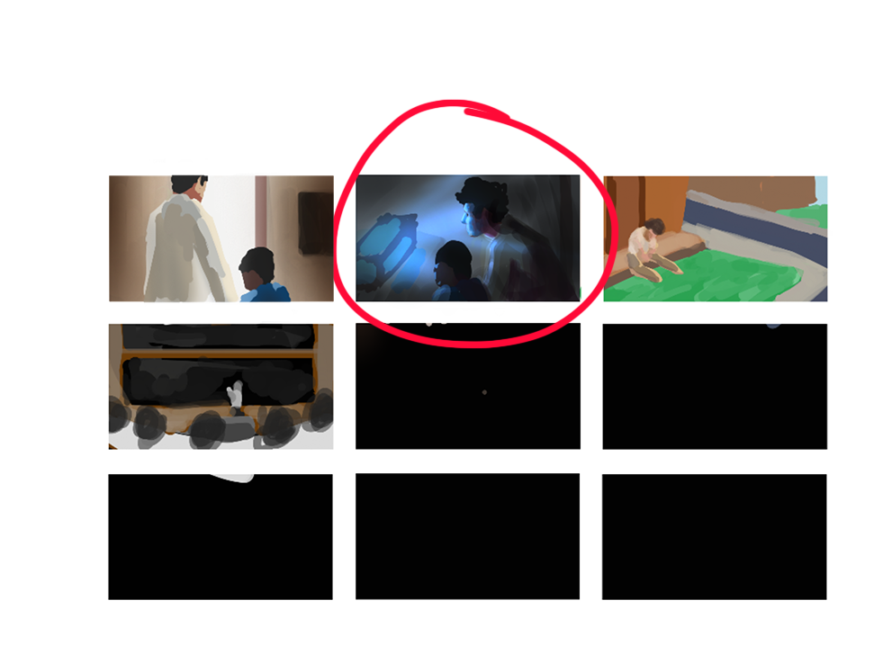
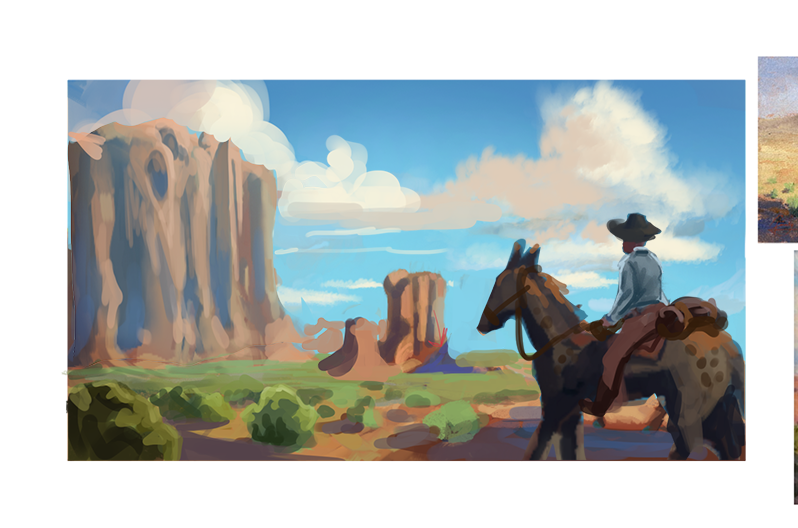

This week was unproductive. I tried my best to do the exercise but I struggled to get myself to put
something on the canvas. In a sense I was paralyzed, the exercise that Steven gave me this
week showed me all the skills I don't have yet. The top three problems I saw were these: I can't come up
with an idea, scaling issues (related to perspective), and character gestures. Steven gave me tips to
overcome these problems.

 ## Instruction

The exercise for this week has three steps. The first step is to create several thumbnail sketches,
keeping it rough just enough that the image is clear, placing the general composition. In the second step, choose
some of the thumbnails from the first step and resolve it a bit more. The goal is to make the image "precise".
Adding more detail to the image and resolve what's in it. That means clearer shape, values, and color. The
third step, choose some of the thumbnails to polish. After the third step, the image should be shareable,
"instagram worthy" if you will.

I had a hard time with the exercise. The most important skill for the first step is coming up with ideas for
an image. That was challenging for me, who knew it was hard to put down a sketch of a general idea. Usually,
when I have an idea for an illustration, I just dive right into painting it. I see now that approaching a
painting like that could be costly. There's was no way of knowing whether it would be a good painting. If not
a lot of time would be spent to make it work or just share it as it has resolved. The first step is a good exercise
to try out different compositions for a painting in a short time. But creating thumbnails for different ideas
is hard for me, maybe I should modify the rules. For the first step,maybe it should be to create different
thumbnail sketches for the same painting idea. That should be draining since I don't need to create a new
idea for each thumbnail sketch. Instead, each sketch is a representation of the same idea turning the first step
into an exercise for finding the best composition.

The second step is a bit easier than the first, but it was still a challenge. It's easier since I already have
something to work with. All I had to do was add more detail and make the image clearer. However, the challenge
for me was that the image wouldn't look right. I can add more things and a bit more detailed but it would feel
like it's not helping the image. The painting would look flat. That's because of issues with my drawing skills
in terms of perspective. I discussed it with Steven and showed me some tips to fix some of my issues.

I didn't get to the third step yet, so I can't say what challenges would come up. But it should only be polish work.

Here's what I was able to make, with Steven's paintovers.

*thumbs-1*

*thumbs-1 paintover*

*thumbs-2*

*thumbs-2 paintover*

*cowboy*

*cowboy paintover*

*mask*

## What I Learned.

This week, I learned that I can't come up with a lot of illustration ideas in a short time. To work around that I think
I should just stick with two to three ideas per session. Find the best composition for each idea, then put more work
on the best ones. For My issues on perspective/scaling issues, I just need to do more perspective drawings and watch
some tutorials about it. I also plan to do gesture drawings daily using quickposes.com . Maybe go for 1000 hours of
doing gestures (haha that's impossible).
