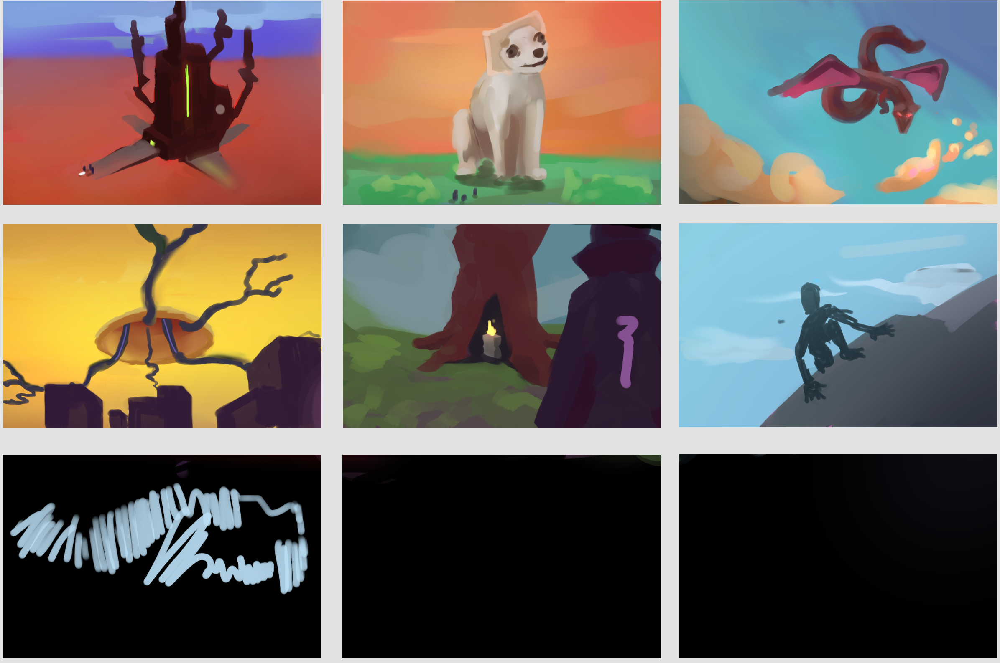
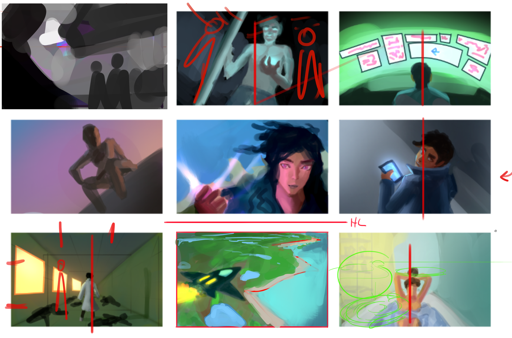
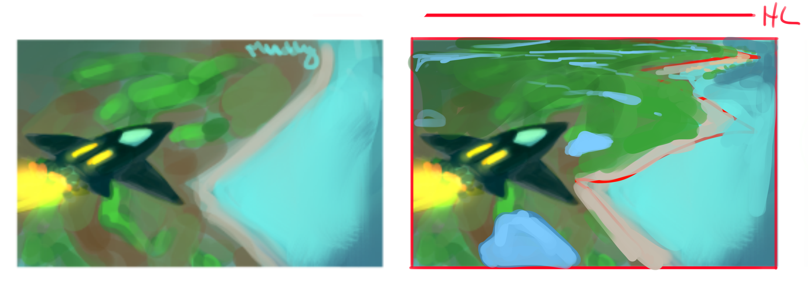

I did more of the same exercises as the previous week. Still a bit unproductive though, I got hooked with
playing "No Man's Sky". It is a beautiful game. With that, I ended up with only a couple of thumbnails for
the exercise. What' different is that ideas flowed much easier than before. The tips Steven gave me helped.

Here's the stuff I did:

Aside from the problems I mentioned in the provious post, I noticed another problem with my thumbnails.
They are so boring. I expressed this to Steven on our weekly call and he pointed out that my compositions
are mostly centered. See the painover below.

Having a centered composition isn't a bad thing for some illustration ideas but it could be boring for most.
He said that good illustrations have interesting compositions. The blandest composition is having the focal point
at the center of the image, what I have been doing for most of my thumbs. I've read and watched tutorials about
this before, somehow I still manage to forget about it.

The easiest trick for an interesting composition is using the "rule of thirds". You can google it if you want
but it's where the focal point is put off-center and nearer to one of the corners of the image. Though I think
it's from photography the rule of thirds is still relevant in art, we're all just making an image after all.

Steven also suggested that I try to improve my perspective since it can also help with creating an interesting
composition. For the thumbnails I did so far, I was not thinking about perspective, I think that's why they
don't feel believable. Look at the comparison between my original sketch and Steven's paintover. The paintover
is much more believable even though it's also just blobs of color similar to my thumbnail. The difference is
that the horizontal line (perspective) is being considered.

## What I Learned.

The most important lesson I learned this week is that perspective is important to create believable illustrations
along with an interesting composition. Adding a horizon line before starting a thumbnail sketch triggers something
in my brain that I start sketching in perspective. Granted it's not accurate, it still makes better results
than my previous sketches. I will look for more tutorials about perspective to refresh and improve my knowledge.

Also, I have an idea of creating a photoshop file to put essential reminders. That way, I can open that file
every time I start to work on an illustration so I don't forget. It should prevent me from making "beginner mistakes"
and spend more time on developing the idea. I will share mine once filled it with enough reminders. I wonder if people
already have a similar file though.
