The problem that came up the previous week is my boring composition. Steven's primary suggestion is
to start with a horizon line. I took another step adding vanishing points and a grid. I noticed a
drawback to this since with the grid, I tend to immediately draw things along with the lines. That
could be helpful, but I think that by adding a grid I limited myself to that perspective. Maybe I
should try adding the perspective grid after I am done with my sketch.

I tried to keep in mind the composition of my thumbnails this week. I found a way to easily adjust
the composition by adding a "frame" layer on top of everything. It's just a rectangle not too interesting.
But when I am done with my sketch, I can move it around and change its dimensions quickly. It's easier
than changing the dimensions of the document. You can try that on your workflow too if you want.

Here are some of my thumbnails for this week:

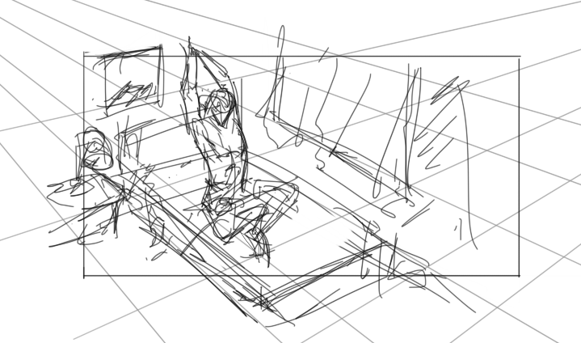
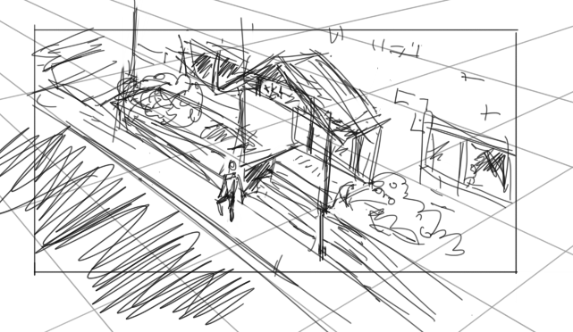
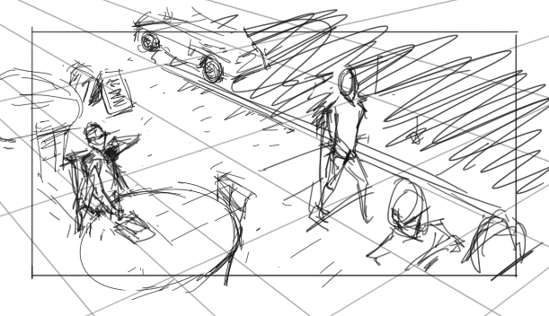
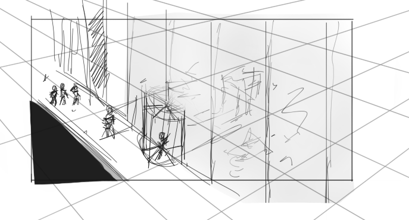
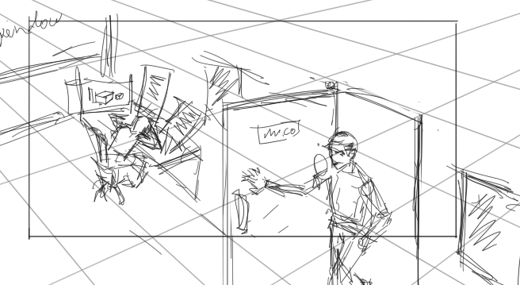
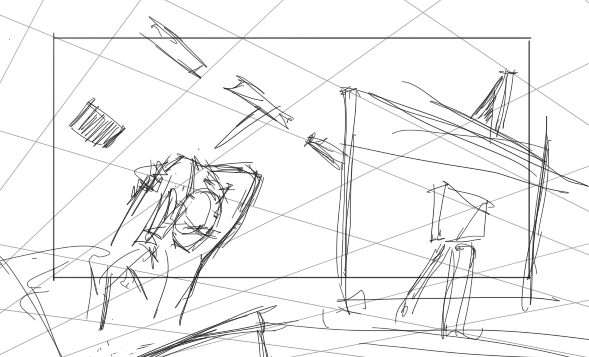
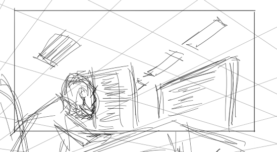
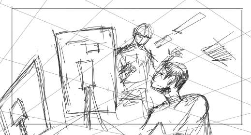
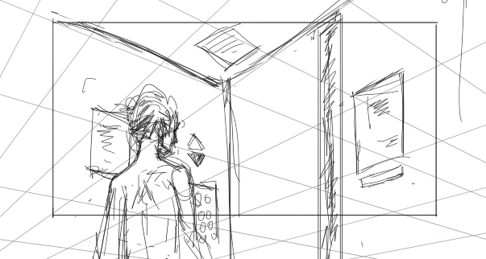

I think that the sketches with the computers are the more successful ones and Steven thought so too.
The reason why I think it's good? I don't know, but those thumbnails felt like they are telling a
story. There's always a story behind every image, but some just deliver it better than others. That was
the case with these thumbnails that I was able to get out of me (accidentally).

Steven did suggest a book called "Framed Ink". I haven't read it yet, but I will start this week. The
answer to why those thumbnails feel good might be in there. Another comment Steven had about those
specific thumbnails is that painting them would not add much value. They are good as a drawing or sketch
but as paintings, they would not be great. I'm not sure if I agree, however, I don't want to paint it too
since it's not an image I want to spend my time on.

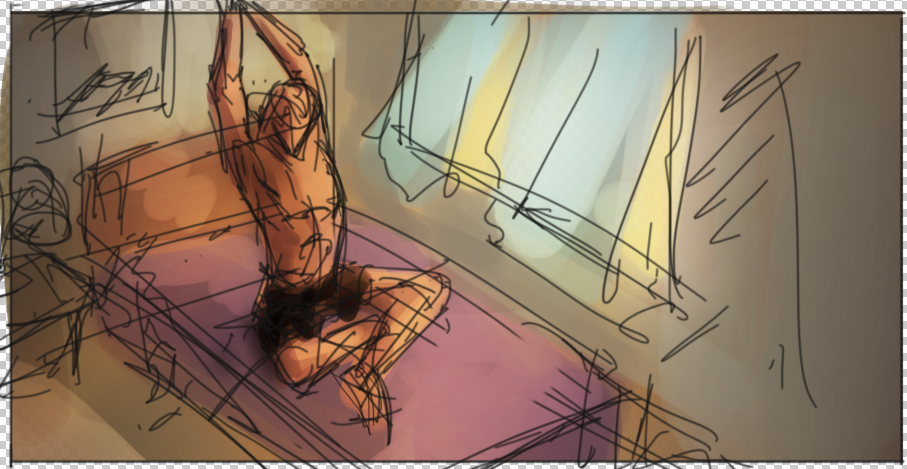
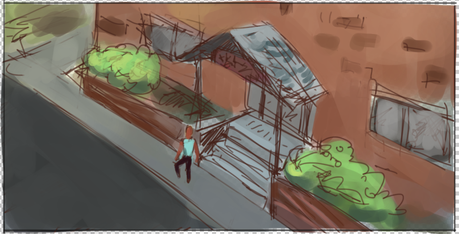

I did try adding color to two of my thumbnails. And I learned that shadows are very important in a painting.
The ones above are my same old mushy color sketch which adds colors that I want and some sort of lighting
in the thumbnail. The problem with it is that it doesn't make the painting feel three-dimensional. Look at Steven's
paintover below.

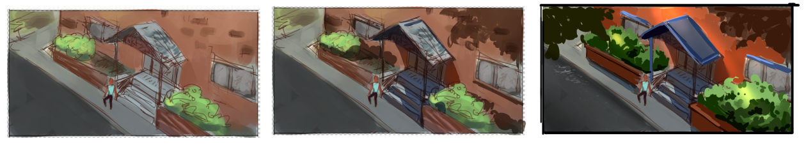
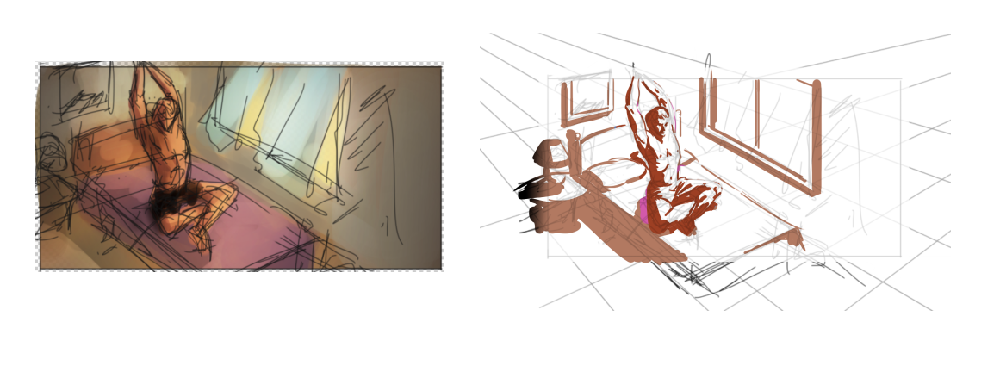

He emphasized to me the importance of shadow in making paintings feel real. Notice in the first paintover, the
only thing he added to my thumbnail is the shadow, and it already looks a hundred times better than what
I originally have. He did the same thing with the second one but without the colors that I painted in. Even
without the colors, it is more believable than mine.

The exercise for week 5 is to do shadow thumbnails. Still the same process as the previous weeks but changing
the focus to shadow design.
