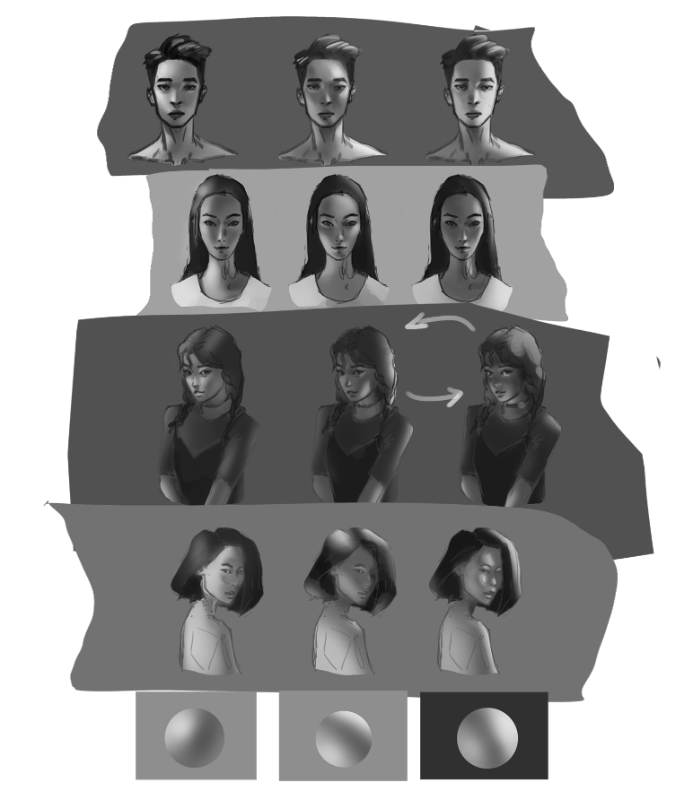
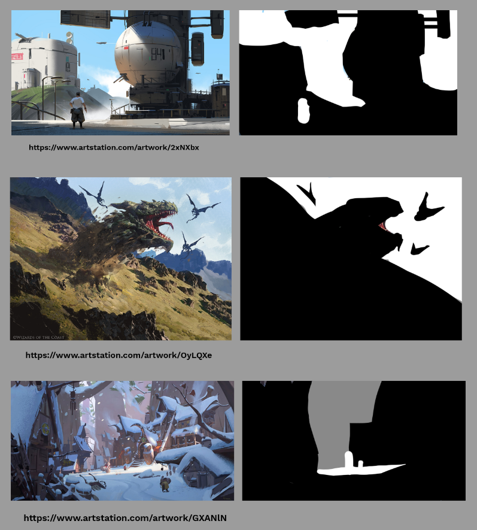
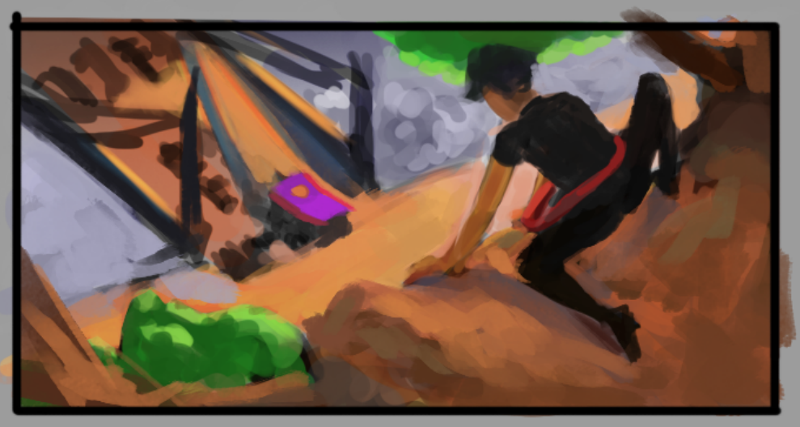
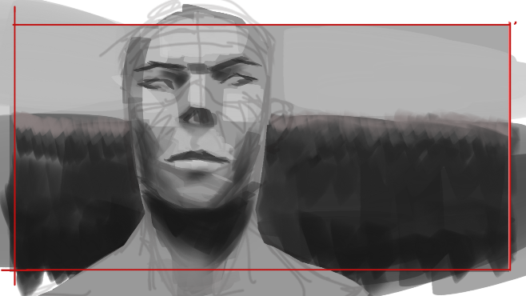
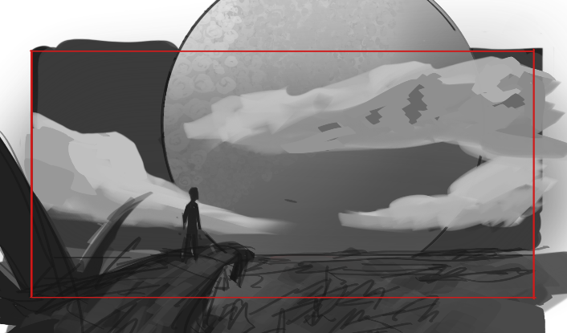
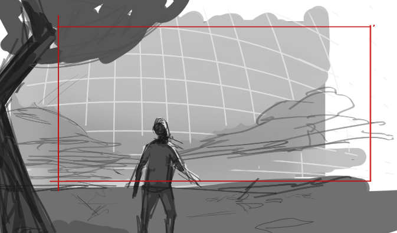
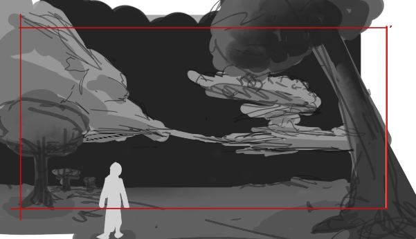
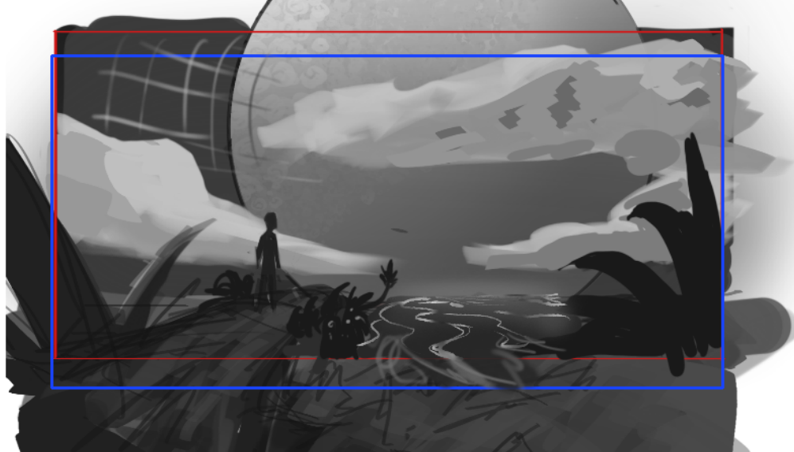

I feel like I learned a lot this week. I read "Framed Ink" in one day, might have gone through it
too quickly. Also did the assignment for Ahmed Aldoori's "Lighting for Painting Heads/Faces" tutorial.
I decided to do Ahmed's tutorial since the exercise for this week is doing shadow shape thumbnails. First,
I had to study the face for some time before I started doing the assignment to refresh my memory about
the face planes. Then I extracted the lighting scenarios from three images just as Ahmed instructed, and
rendered my face sketches according to the three lighting situations. Still needs some work though, they
don't feel solid and the planes are not clearly defined.

Speaking of shadows and lighting, they are a big part of "Framed Ink" for composing the shot. The book
emphasized the importance of easily readable compositions and the mood it delivers. It comes down to the
shapes of elements like the environment and how the lighting lays down on the subjects in the shot. Shadows
can be used to guide the viewer's eyes to the focal point while also showing the dimensionality of the object or
character. It is a great tool to use! Knowing that doesn't mean I could now use it successfully though.
I feel like being able to create good compositions is a high-level skill.

I think that the compositions in the book are only good because every other aspect of what makes a drawing
good is already great. Composition design wouldn't help a drawing if the perspective is inaccurate, the
subjects are out of proportions, and figures are wonky. The more I read the book, the more I feel like I
have to get back to improving my fundamentals.

I expressed these during my call with Steven. Although he doesn't disagree with it, he thinks that it's
still important to keep trying complete images. He said that there are no going around the fundamentals but
putting my time on one aspect at the time would not help much (or something along those lines). It makes sense.
If I focus only on perspective, I probably still wouldn't be able to create good images. What's good
perspective when the characters aren't good? If I learn the fundamentals along with trying to create a good
image, I can see what I'm lacking immediately. If the perspective is good enough, and the figures don't
look too good, I can try to study the specific pose of the figures. When it's good enough, move on to lighting,
and so on until you have a good enough image. As illustrators, we don't get paid for our individual skills
but for the images we create that requires the combination of all our skills right?

Below is my attempt at extracting the compositions of what I think are good paintings:

Then after I did those composition studies, I attempted at doing my own compositions and did a color sketch:

Steven did a paintover on one of the thumbnails. He gave it more depth and a trick of explaining
the foreground elements by repeating the shapes from the foreground on the midground. Plus he added
the small river streams adding more depth. I wouldn't have thought of doing that at all, my tendency would be
to add a huge single stream which is interesting.

For the next couple of weeks, Steven suggested that I increase the quality of my output a bit. I've only been
doing thumbnails for past few weeks where the expectation is that they are small and not detailed (can't be good)
He suggested that I do a good sketch that can be turned into a good painting without too much modifications, unlike
thumbnails where a lot of things are left unresolved. Also to spend the time to plan the general theme of the 6
sketches I'm going to try to do. Each one a different moment in the story. For each sketch, spend half the time
gathering references and write down which part the sketch is in the story and how it should look like. He doesn't
expect me to finish this in one week. He even showed me that this process is used in the industry. I'm going to do
my best to create my best sketches yet!

