## Week 6

So it has been two weeks trying to create 6 sketches based on a story. In the first week, I tried creating
a story or just an outline of a story that I could use to determine what my 6 story points would be. Luckily,
a friend came to my rescue. She offered to write a story for me. You can read it [here](https://www.notion.so/xanderjakeq/Story-By-Eli-a0c79251a68349f9947691ec5472bff5).

The story is more than enough for me to start with my project. Now that I have a story to work with, I wanted
to start sketching. One problem I had though is that I don't know what the world looked like yet. So for the rest
of the first week of the project, I was referencing, concepting, and trying to explore what the world could look like.

I started with the character. There's not much information about the character in the story but I knew what
the main character should be. She is a strong female character, that can go on solo missions with ease. Based on
that definition, I started designing her.

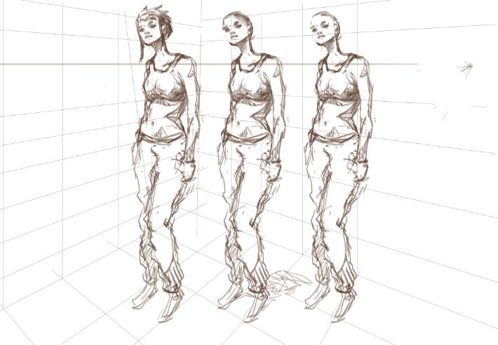

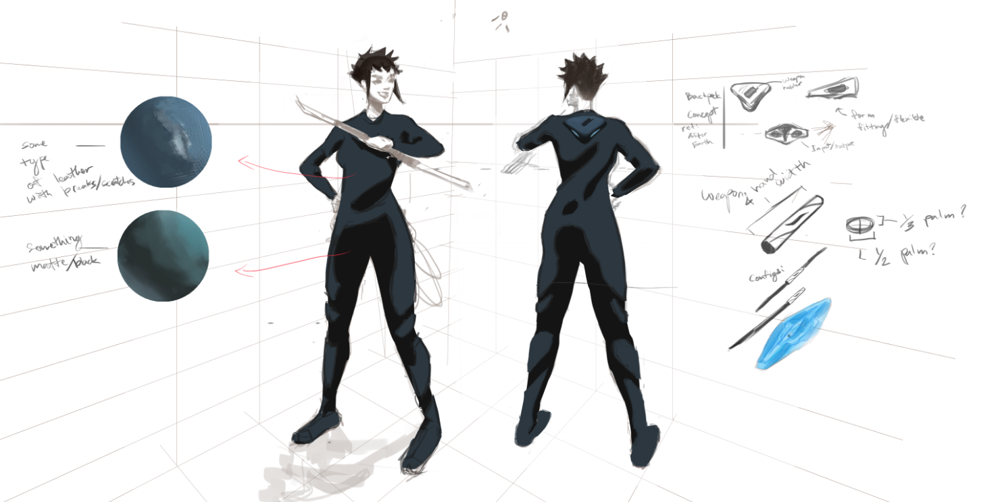

I don't have much experience designing anything. So she came out pretty basic. I started with her having a smug personality
but later on decided that she is a more jolly and carefree character. I tried to communicate that through her facial expression,
hair, and pose. Her costume and weapon designs are straight from the "After Earth" movie. I liked the minimal design and high
functionality of their suite and weapons. I wanted the same thing for the main character of this project.

The next thing I tried to explore is the surface of the planet where the story takes place. This was the easiest part
since it can be very gestural and doesn't need much detail since it doesn't appear in the story too much. But to make it
more believable, I probably should put in more effort. I asked Elisha if this was how she envisioned the planet to be like
and she said that it was exactly how she pictured it, so I'll take that as a success.

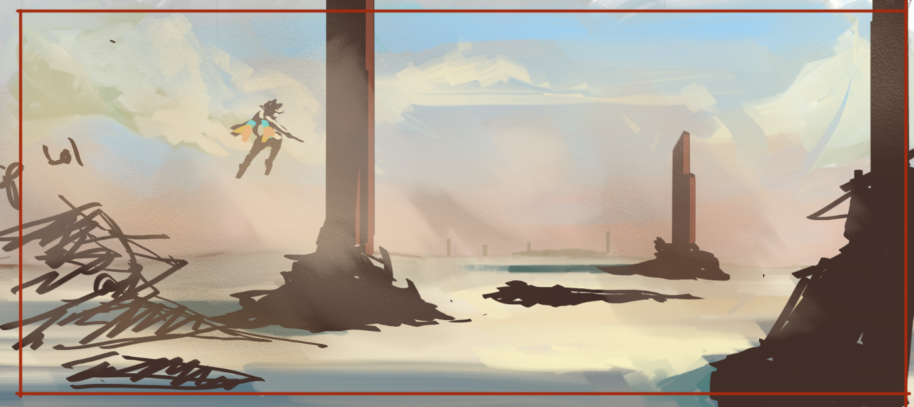

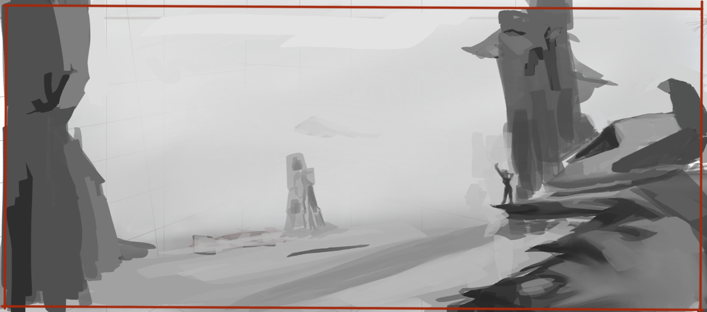

The next thing I tried to explore is the alien city underground. I tried to come up with different shapes of
the buildings. The architecture should reflect how the characters living in them are like. Unfortunately, I haven't
gotten into trying to design the alien creatures. I wanted them to be kinda cute but still capable of evil. Based on
the things I've read before, circles represent cuteness and harmlessness while sharp things represent danger or evil. So
I tried to combine those two shapes.

However, I'm not at all good at it, and ended up with these. The idea that I wanted to implement is that the city
will resemble that of a lotus. Where the power source of the whole city is at the center and the petals would be the
buildings. I tried making a building out of a petal shape after trying other different things. I think these were
unsuccessful.

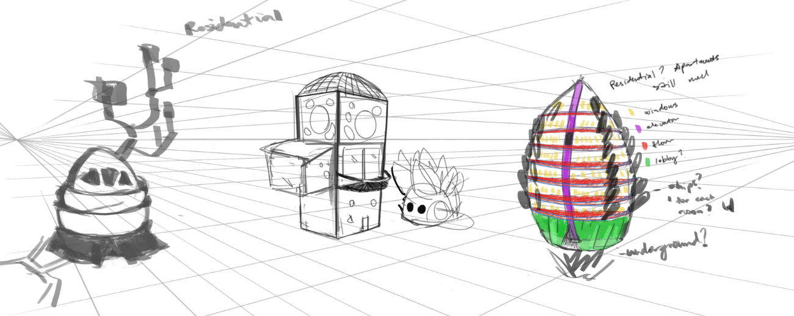

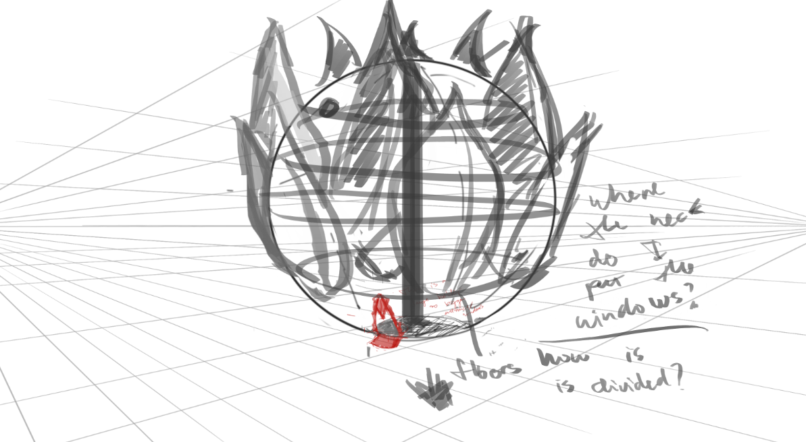

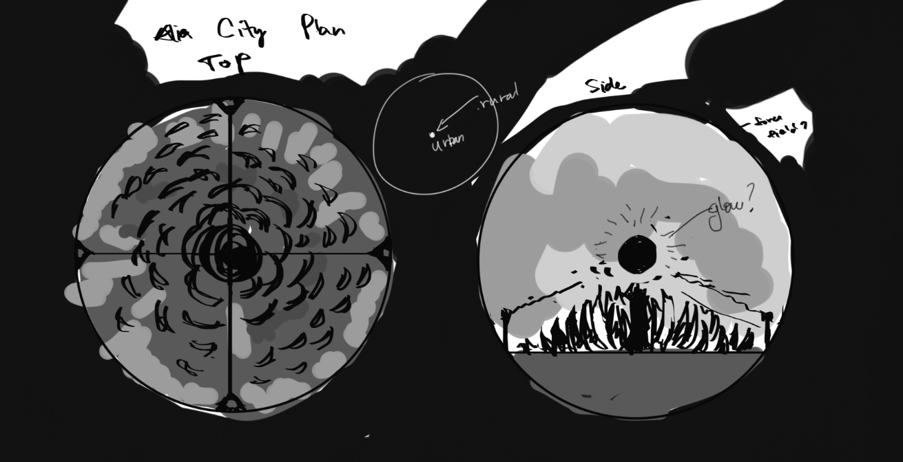

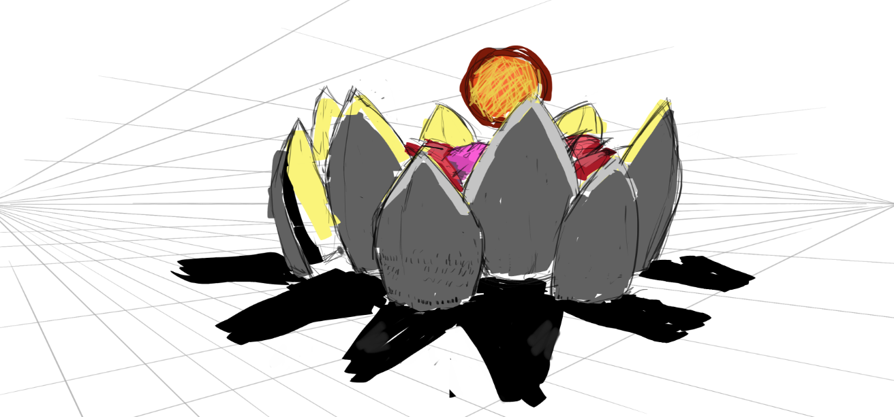

## Week 7

For the second week, I decided that trying to design everything in the world would be too time-consuming. I started
to work on my first sketch. The story point is the introduction of the character. I thought the best way to introduce
the character is to show how she lands on the planet or how she reacts to the entry of her ship in the atmosphere.

Among the thumbnails I did, I liked 3 and 4. Both are the moment where her ship inters the atmosphere, where the front of
the ship should be burning. The third thumbnail shows her relaxed and unbothered by the danger while on the fourth sketch she is
off her seat in excitement as if she was on a rollercoaster ride. I tried doing the 4th thumbnail first.

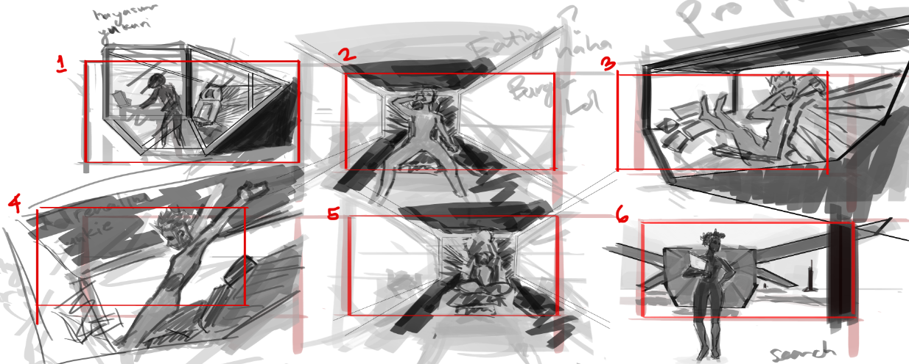

For this sketch, I tried to position the camera so that it would show most of the main character while still seeing the
chaos outside. But I did it poorly and the perspective of it is all wrong.

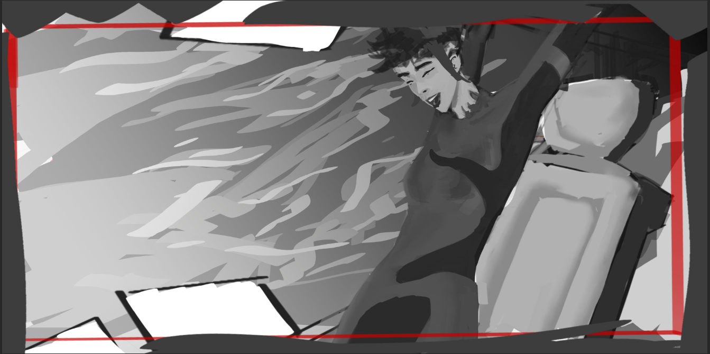

I tried the same idea again but trying to keep the energy and feeling that the thumbnail had. I feel like this one is pretty good.
I initially labeled this as the "Andrenaline junkie" pose. Steven pointed out that it didn't read as "Andrenaline junkie". It looked
like she's only stretching, and has a relatively calm expression. It would be better to try to express that calmness with the idea
presented in the third sketch.

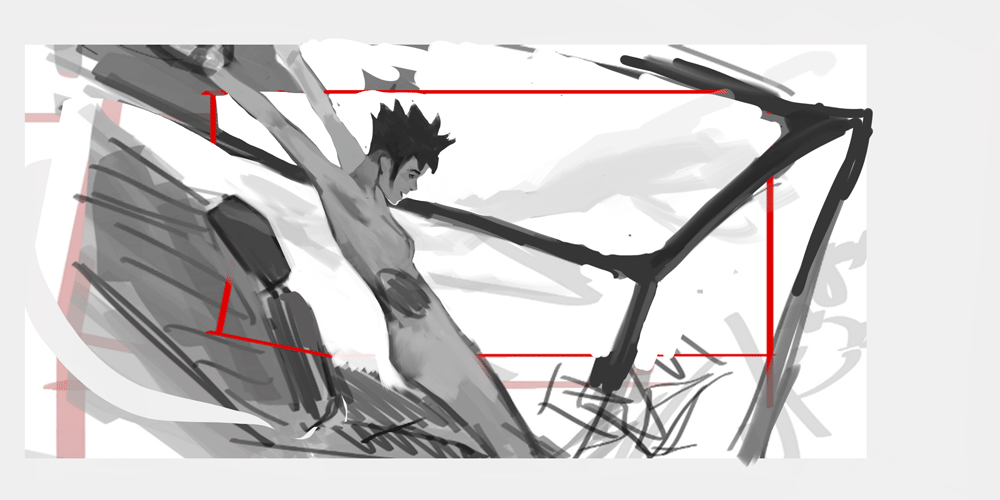

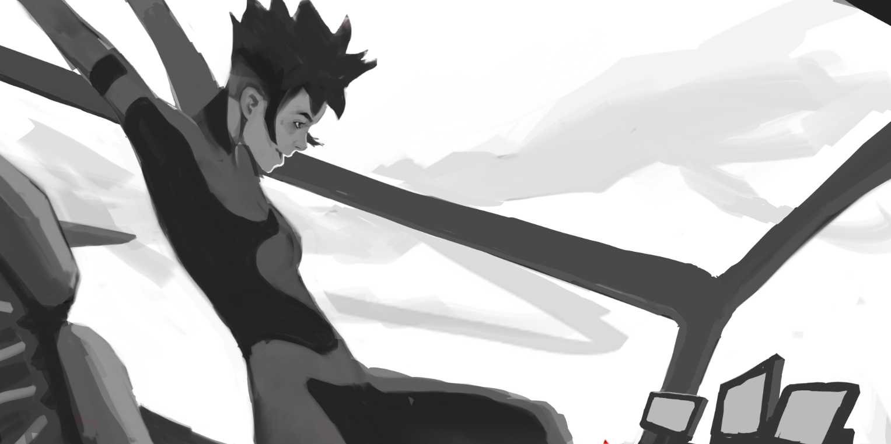

This is my first exploration of the third thumbnail. But in this sketch, the character is way too small in the composition. That makes
it hard to communicate her personality.

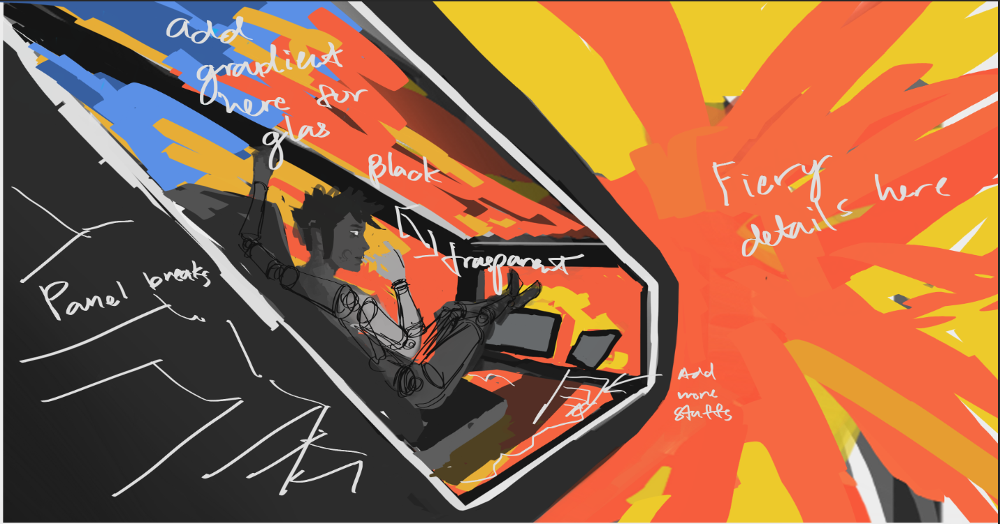

This second exploration of the third sketch is the best one for the first shot. It shows most of the character which allows me to show
her calm personality contrasting with the chaos outside.

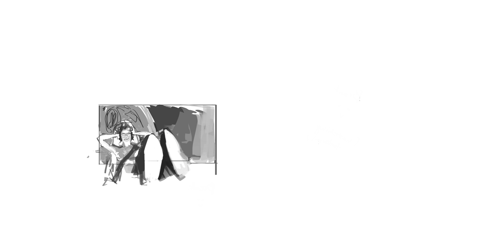

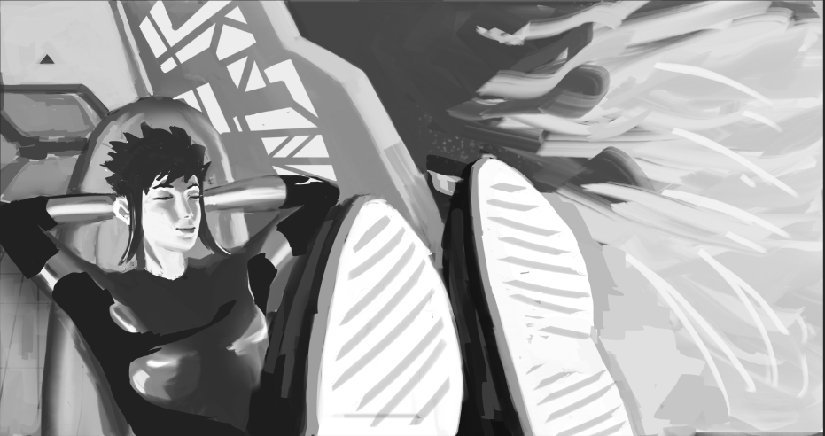

Steven did his sketch of this idea in under an hour. It is way better than what I have.

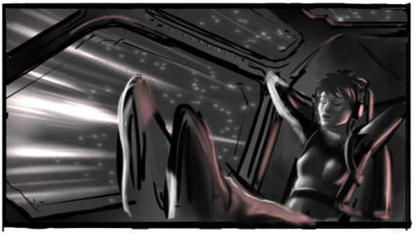

The main differences between my sketch and Steven's are composition and values. One compositional problem on my sketch is that the window
is too open and flat. There aren't many breaks in the huge area of the image. On Steven's sketch the window supports help make it clear that
the streaks of fire are outside of the ship.

In terms of values, my sketch is way too light. Steven's version is darker, this allows the streaks of fire to be able to glow and be bright.
The darkness also allows for the form of the character's figure to be emphasized with the strong light on her. On my version, I made it light
because I tried to make it make sense from a reality standpoint. There is a window in front of her and the center of the burn while entering
the atmosphere is directly in front of her. There is also a window to her left. so it should also be bright on that side. The only part of
her that would have some shadow would be her back. That was my thought.

However, not all realistic situations make good paintings. I will apply what I learned so far on future artwork.
