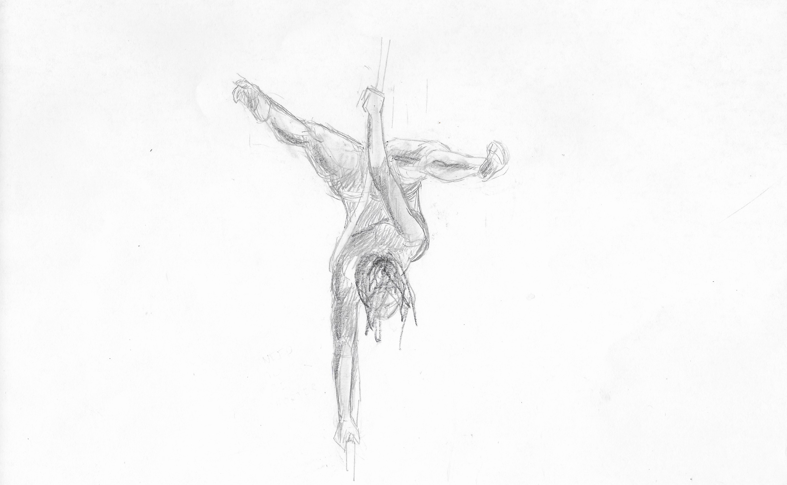

# Taking a break

The next scene for my 6 sketches project involves a city. I quickly realized that I don't know how to do them.
I did a few attempts but they never look right. The buildings become too similar and boring, the scales
isn't believable, and I don't know how to create interesting architecture.

For my last call of the 8-call Mentorship from [Steven Zapata](https://www.stevenzapata.com/), I asked about
cityscapes. His process for doing cityscapes is very interesting, it very agnostic to the type of architecture
or perspective.

> What makes a city drawing/painting believable is the scale and detail density.

What he means is that the drawing should include small, medium and large elements. Including an "anchor element"
that the viewer can relate to or something familiar in real life in terms of scale. This could be a "normal"
character, vehicle, window, etc. This is so that buildings can look as big or small as we want.

Another thing that Steven's way of doing cityscapes is to put more details to the smaller scales. More specifically,
add more details to where characters will do most of the interaction to the environment. This could be the the first floor of a
store building, sidewalks, and parking, etc. You can try to observe this with a cityscape photo from google.
Notice that the largest buildings have the most regular pattern on them, like the huge windows that looks the same
from top to bottom. Then observe that the closer to the groud, the more details there are. Of course there are
exceptions, these are Steven's general observations of what sells a city concept.

This is my most recent attemt at the city sketch for my project. I feel like it is more interesting than what I've
done so far. (I will include past attempts when i get to it)

Because of the stuggle of doing cityscapes, I lost my motivation and momentum on doing the project. I ended up trying
to learn other things. At the same time as I was struggling with buildings, schoolism was on sale so I got their one year
subscription. Currently, I am learning "Deconstructed" by Viktor Kalvachev. I will be taking a break from doing the project and
mentorship from Steven. I will try to focus on the Schoolism course for a few months and try to do the project again. I feel
like I need more training before I get on another call with Steven. With the first eight calls, I have a pretty good grasp
of what I am lacking.

The first I want to tackle is figures. If I want to be an illustrator, 90% of the images I make will include at least
one character. So it would make sense to invest some time be able to draw figures correctly.

These are some of the assignments I did for "Deconstructed". I hope I will get better at drawing figures soon even without
using references :)

