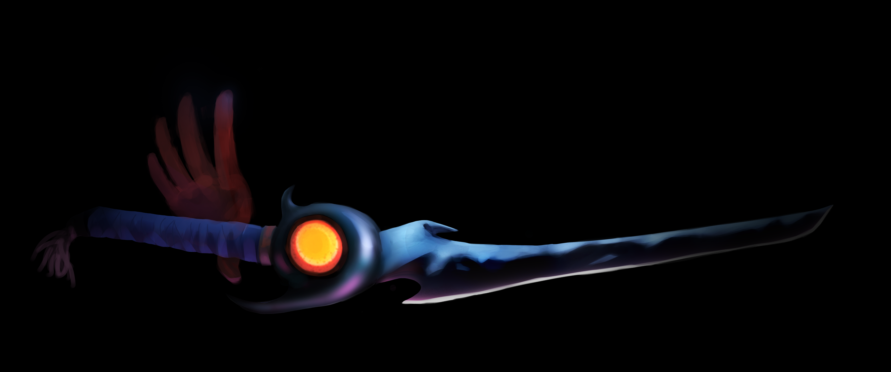
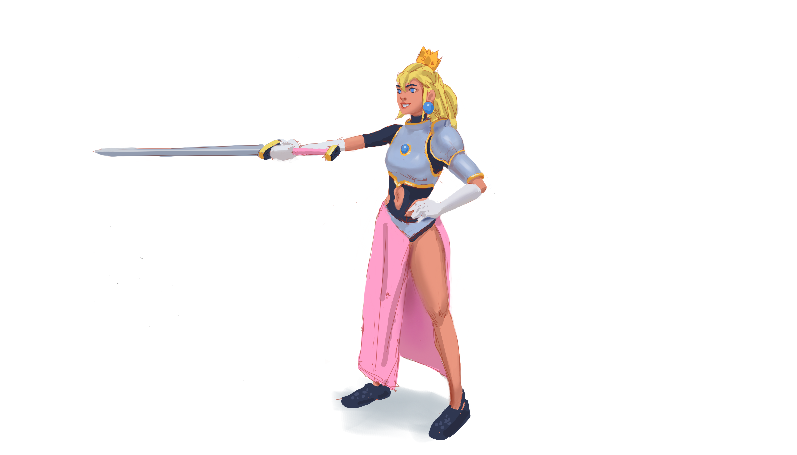
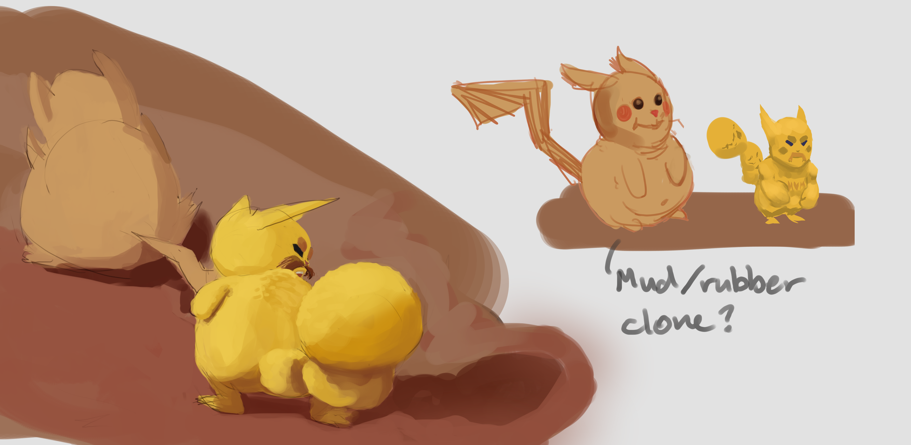

It has been about 5 months since my last post. In that time, I'm kept on trying to improve my skills in art.
I did a couple schoolism classes among other sources, and joined Sinix's ChromaCorps. I didn't really join
it since I didn't make the cut of 16 artists to join the contest. People still made art with the propmts
from the contest including me. I made some friends from that event. Which is really cool. xD

Here are some of the stuff I made for ChromaCorps:

I don't know why these images look so bad, but see higher quality [here](https://imgur.com/a/uWvk4aT).

Also had the [Anthony Jones](https://www.robotpencil.net/) character design class.
I learned two things from AJ. First is the process of designing a character (obviously lol), before the class,
if I try to design a character, I wouldn't do thumbnails the way I should. What I used to do is make one small
sketch, scale it up and try to push it to finish. Which rarely works. The process I learned from AJ is to create
multiple thumbnail sketches where each have a unique feature to them that would reflect the character. Then pick
a few of of the sketches and polish them a bit more, do it over and over until you pick the one the you think is
the best design.

Here is the work I did for the class. Better quality on [Artstation](https://www.artstation.com/artwork/8eOWZQ).

(I am not happy with the third character)

Compared to the first image on this post, the one I did for ChromaCorps, these are better. For the ChromaCorps
characters, I used my old method. I thought I did a decent job at it, but looking at it now...
they're a bad design lol.

## A note on Design

After the AJ's class, I asked [Steven Zapata](https://www.stevenzapata.com/) for some feedback on my work. He
told me something interesting about design. He said that good design are always in context to a project. He said
that what I have are good pictures of some characters. My work doesn't communicate who the characters are or what
they do or where they're from. I guess that's to be expected, since at the start of AJ's class we were asked to
pick any theme. I picked "Scifi casual", which isn't enough information to make good character designs. It only
tells me how the characters should look.

So at best, my character designs are incomplete. Steven said good designs come out of projects, whether it be
a game, movie, or architecture. A thing is only well designed if it serves its purpose to achieve a bigger goal.
I am considering getting back on the 6 skeches project thing I was doing, maybe I can create better art for it
with my new/improved skills. The things I've done for it so far are very mediocre.

## Confidence?

The second thing I learned from AJ is about my general lack of confidence. He picked it up that I was not a
confident person quickly. I am aware of this but I don't know how to stop. I often use phrases like "I don't know" or "I guess" a lot in our calls for the class or everyday even xD. He had a lot of advice about it and stories
of other people who are just like me that became good artists. But the gist of what I understood from it is that
I may not be able to stop myself from being shy, but when looking at my work, I need to look at them objectively.
Look at them among all other similar work, and they might not be as bad as I think they are. Also that it is
okay to be in the "I don't know" state but not to stay there. If I find myself saying that my art is bad,
I need to ask why, AND find the answer.

