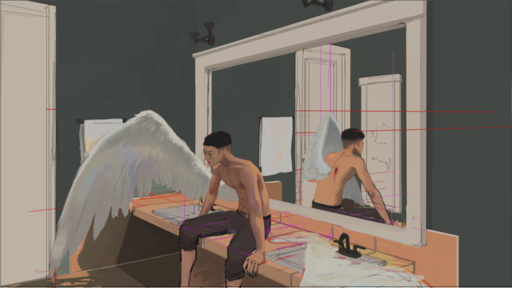
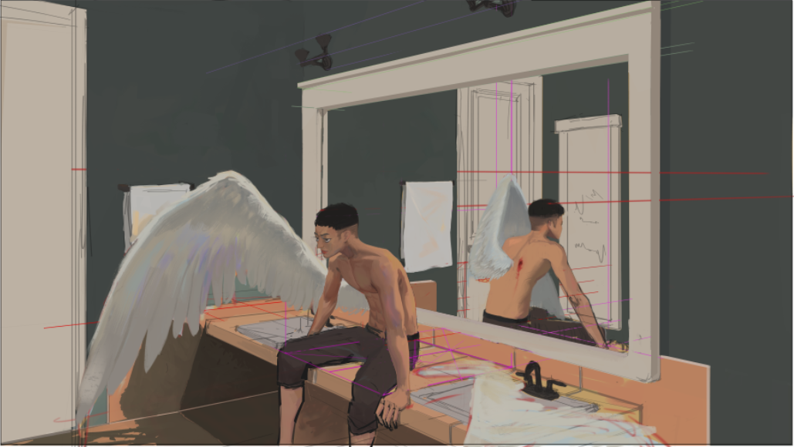

## Definition

For context, this is about the learning process. Most of us find it painful
and scary to learn new things. I am talking about the fear that you can't do
what you expect yourself to be able to do, to be a failure. I only talk from my
experience and thoughts. Concepts might be a repeat from things all over the
internet.

## Story

I have a lot of interests and skills I want to learn. After a couple weeks or
days trying to learn something, I would usually give up and move on to the next
interest. The main reason is the frustration of not being able to do what you
want immediately. If you're trying to draw a face, the other eye doesn't look
right, when singing you sound like a dying goat, etc. This is the cycle that I
was in for the longest time.

The moment this cycle was broken was when I decided to be better at art.
'Getting better' is a vague goal, I didn't necessarily know where to start, but I
did. I started with faces, then anatomy, and all other aspects of creating a
good image. What's interesting is that a new cycle replaced the old one, but
they are similar. As I was learning different aspects of art, I did not master
one and moved on to the next. I learned a little bit of information about it,
then to the next one. Instead of changing interests or skills, I kept myself
within the domain of art. All the little things I learned helped me to be
'better'.

For a time, that is all I did. I was improving but not at the rate I wanted. The
next step I took is to add structure to my efforts. First is to set a specific
goal, learn about it with resources available, take notes, apply what I learn on
the next drawing or painting, evaluate, repeat. While doing this, I am
emotionally detached. My art does not represent my whole being. If I see
something bad in my work, I point it out. Take notes about what I would like to
improve. They will be my future goals.

At the learning step, I pay attention. Sometimes, explanations of concepts can
be very abstract. I would never draw while I am watching a lecture. Watch,
listen, and observe. How an image is created is as important as how it looks
finished (if you're trying to learn). Maybe the missing information I need is
how the marks are made, or the sequence they are done. I take notes of new or
important information from the resources I consume. I use my notes when I try
out what I learned. I know it's tempting to make a 'mental note', that doesn't
work so well, at least for me. Other thoughts unrelated to my goals will
distract and make me forget. That would be a waste of time, to be safe, I write
notes.

Real learning happens when I use what I learned on a new drawing. I used to
start drawing how I always draw then I draw with the new information in mind.
You can use the first drawing to compare the art with and without the new
information. This takes longer so I usually just do the latter, I have enough
bad attempts to compare my new drawings to. I compare and evaluate my new
drawing, most of the time, it's better than my past attempts. But I try to be
specific on how the old one is worse, and which aspects of the new drawing need
improvement. For the next drawings, they will be the focus.

Also, I ask questions. When something doesn't look right, I ask why and try to
find the answer. If I follow a process blindly and the result looks good, I want
to know what makes it work. I don't get answers most of the time, or the ones I
get I don't understand. But when I do find and understand the answer, I will
never forget. Still, to be safe, I will write notes.

For example, currently I am practicing using perspective. I know most of the
theory but most of my art lacks a feeling of space. While working on this image,
I was constantly bothered by something. I didn't know what, but I knew it had
something to do with perspective. The top of the mirror didn't follow the grid
properly, the image felt better when I fixed it. See the before and after.

The change is very small, but it makes the image way better than before. Still
not the best it could be, there's a lot of room for improvement. I am still
proud of this piece. I applied my perspective knowledge, which was my goal. I
asked myself why the first image felt weird and I found the answer. It feels
good to be able to do so.

## Conclusion

The satisfaction of making a better image is my antidote to the fear of learning
new things. I am willing to be frustrated at my incapability, my lack of skill
and knowledge. It will be challenging, the better images I will create makes it
all worth it.

It's okay to not be perfect. In a learning environment, nobody is expecting
perfection from us. Try as many times you as need to learn something. No
judgement.  If you need, do your learning in isolation or with a small group you
trust. As Steven Zapata said, "It's not about you, it's about the art." Good
critiques are not about you, and

WRITE NOTES.

[How to study](https://www.youtube.com/watch?v=8kfK46nruKM) by Anthony Jones
also helped me and might help you too.

