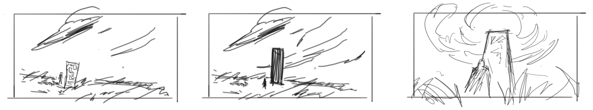

I get it. Watching time-lapse videos of your favorite artists gives you a boost of motivation.
It makes you want to paint your own ideas. Then hours later, either you crash and burn or feel
fulfilled after finishing a painting (good job!).

Motivation is one effect, but there is another that might be unnoticed. That is the fact that it
makes you think subconsciously to match the speed of that video. Logically, you know that it is a
time-lapse, the artist spent more time than what the video length is. But ever question yourself
"It's already been 20 minutes, why doesn't this look good yet?"

That's your brain comparing the time-lapse video and your real-time progress. If you are experiencing
this, there is a solution to that.

Stop watching time-lapse art videos.

That is the simple answer. In reality though, time-lapse are videos are hard to avoid. Artists
use them so that they could do a good commentary without wasting time. That is an acceptable video
to watch by the way. The ones I'm against are those without commentary.

It feels good to watch them, but know that it is hurting you, if you watch too much. Everything
is fine in moderation. You can also try to strike a balance by watching real-time videos.

Here are my recommendations for artists who post real-time videos:
- [KNKL](https://www.youtube.com/user/KienanLafferty)
- [FZDSCHOOL](https://www.youtube.com/user/FZDSCHOOL)
- [Steven Zapata](https://www.youtube.com/channel/UC6xmTPctXnbW7PyoNwSZ1LQ)

To help solve the problem, I will only post real-time art videos. If I do post a time-lapse, I'll
be sure to add the total time spent working on it for reference. If you are an artist planning to
post your process for people to see, I invite you to do the same.

